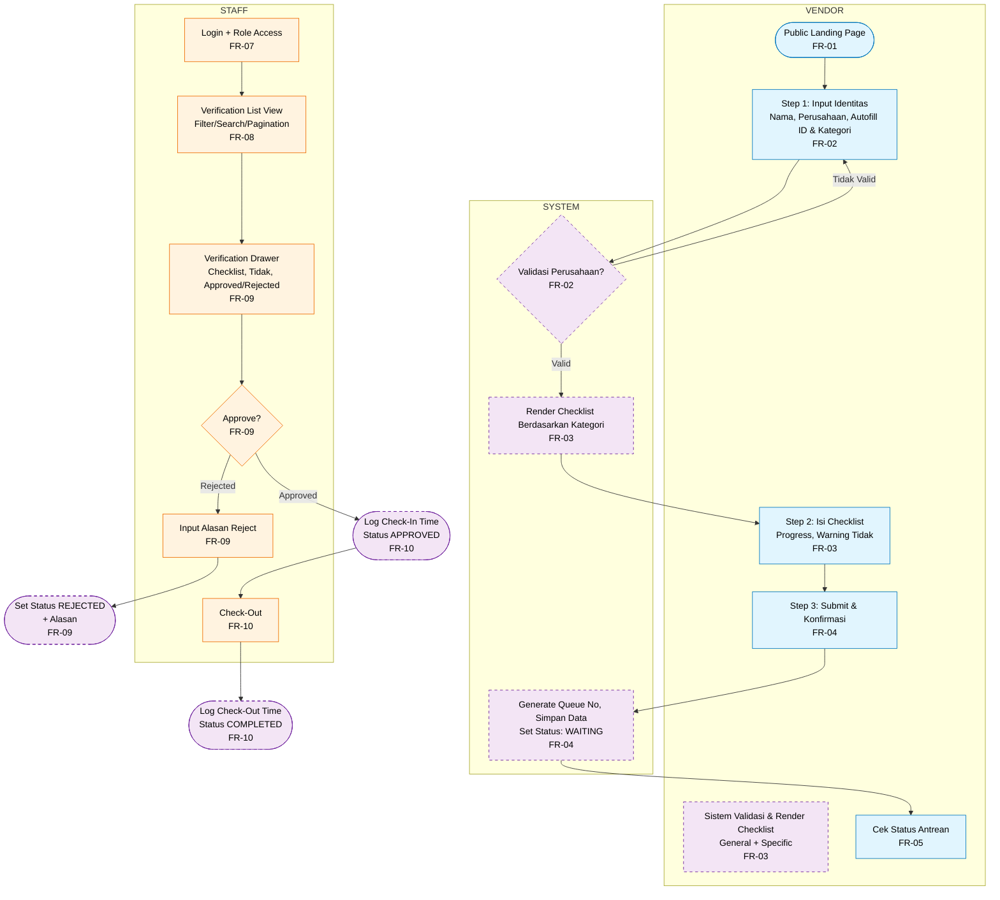
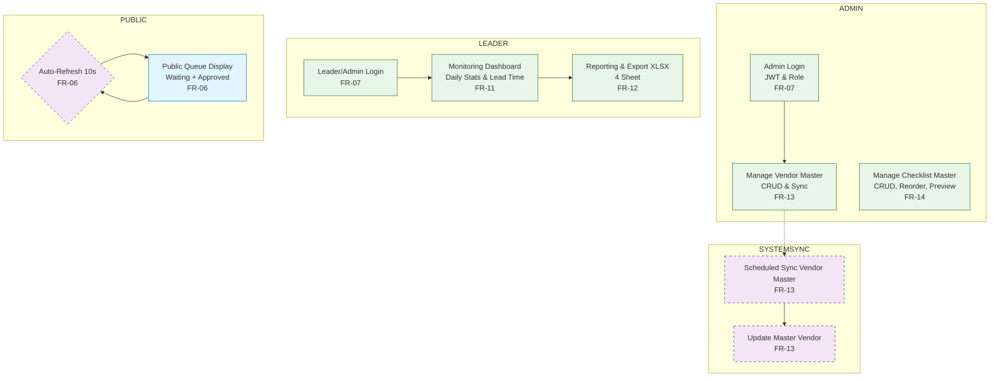

## User Flow

> Copy paste code to https://mermaid.live/edit for better view

1. Main Operational Flow (Swimlane)

```mermaid
flowchart TD
    classDef vendor fill:#e1f5fe,stroke:#0277bd,color:#000
    classDef system fill:#f3e5f5,stroke:#6a1b9a,color:#000,stroke-dasharray: 5 5
    classDef staff fill:#fff3e0,stroke:#ef6c00,color:#000
    classDef endpoint fill:#000,stroke:#000,color:#fff

    %% --- VENDOR LANE ---
    subgraph VENDOR
        V_Start([Public Landing Page<br/>FR-01]):::vendor
        V_Input[Step 1: Input Identitas<br/>Nama, Perusahaan, Autofill ID & Kategori<br/>FR-02]:::vendor
        V_Check[Sistem Validasi & Render Checklist<br/>General + Specific<br/>FR-03]:::system
        V_Fill[Step 2: Isi Checklist<br/>Progress, Warning Tidak<br/>FR-03]:::vendor
        V_Submit[Step 3: Submit & Konfirmasi<br/>FR-04]:::vendor
        V_QueueDisplay[Cek Status Antrean<br/>FR-05]:::vendor
    end

    %% --- SYSTEM LANE ---
    subgraph SYSTEM
        S_Validate{Validasi Perusahaan?<br/>FR-02}:::system
        S_Render[Render Checklist Berdasarkan Kategori<br/>FR-03]:::system
        S_Save[Generate Queue No, Simpan Data<br/>Set Status: WAITING<br/>FR-04]:::system
    end

    %% --- STAFF LANE ---
    subgraph STAFF
        P_Login[Login + Role Access<br/>FR-07]:::staff
        P_VerList[Verification List View<br/>Filter/Search/Pagination<br/>FR-08]:::staff
        P_Drawer[Verification Drawer<br/>Checklist, Tidak, Approved/Rejected<br/>FR-09]:::staff
        P_Approve{Approve?<br/>FR-09}:::staff
        P_RejectReason[Input Alasan Reject<br/>FR-09]:::staff
        P_Checkout[Check-Out<br/>FR-10]:::staff
    end

    %% FLOW CONNECTIONS
    V_Start --> V_Input --> S_Validate
    S_Validate -- Tidak Valid --> V_Input
    S_Validate -- Valid --> S_Render --> V_Fill --> V_Submit
    V_Submit --> S_Save --> V_QueueDisplay

    %% PETUGAS FLOW
    P_Login --> P_VerList --> P_Drawer --> P_Approve

    %% REJECT
    P_Approve -- Rejected --> P_RejectReason --> S_SaveReject([Set Status REJECTED<br/>+ Alasan<br/>FR-09]):::system

    %% APPROVE
    P_Approve -- Approved --> S_LogIn([Log Check-In Time<br/>Status APPROVED<br/>FR-10]):::system
    S_LogIn --> P_Checkout --> S_LogOut([Log Check-Out Time<br/>Status COMPLETED<br/>FR-10]):::system
```

2. Support, Monitoring & Data Sync Flow

```mermaid
flowchart TD
    classDef admin fill:#e8f5e9,stroke:#2e7d32
    classDef system fill:#f3e5f5,stroke:#6a1b9a,stroke-dasharray: 5 5
    classDef public fill:#e1f5fe,stroke:#0277bd

    %% --- ADMIN & MASTER MANAGEMENT ---
    subgraph ADMIN
        A_Login[Admin Login<br/>JWT & Role<br/>FR-07]:::admin
        A_VendorMaster[Manage Vendor Master<br/>CRUD & Sync<br/>FR-13]:::admin
        A_ChecklistMaster[Manage Checklist Master<br/>CRUD, Reorder, Preview<br/>FR-14]:::admin
    end

    subgraph SYSTEMSYNC
        SYNC[Scheduled Sync Vendor Master<br/>FR-13]:::system
        SYNC_Update[Update Master Vendor<br/>FR-13]:::system
    end

    A_Login --> A_VendorMaster
    A_VendorMaster -.-> SYNC
    SYNC --> SYNC_Update

    %% --- LEADER & REPORTING ---
    subgraph LEADER
        L_Login[Leader/Admin Login<br/>FR-07]:::admin
        L_Dashboard[Monitoring Dashboard<br/>Daily Stats & Lead Time<br/>FR-11]:::admin
        L_Report[Reporting & Export XLSX<br/>4 Sheet<br/>FR-12]:::admin
    end

    L_Login --> L_Dashboard --> L_Report

    %% --- PUBLIC VIEW / TV MODE ---
    subgraph PUBLIC
        TV_Refresh{Auto-Refresh 10s<br/>FR-06}:::system
        TV_Display[Public Queue Display<br/>Waiting + Approved<br/>FR-06]:::public
    end

    TV_Refresh --> TV_Display --> TV_Refresh
```
