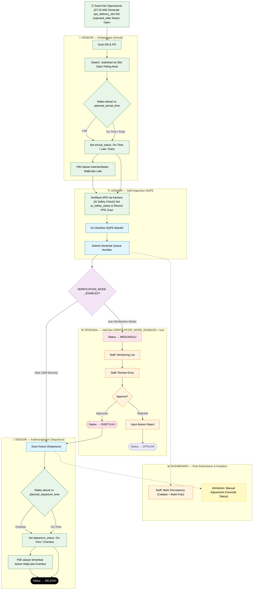
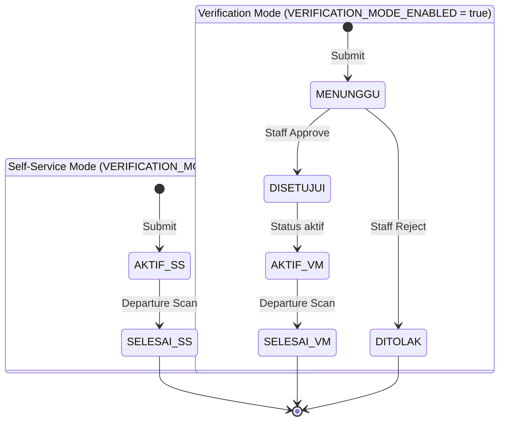
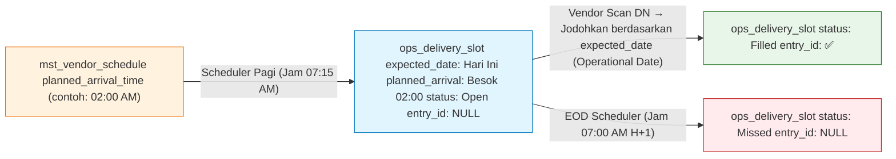
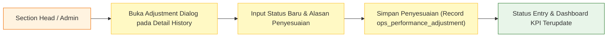
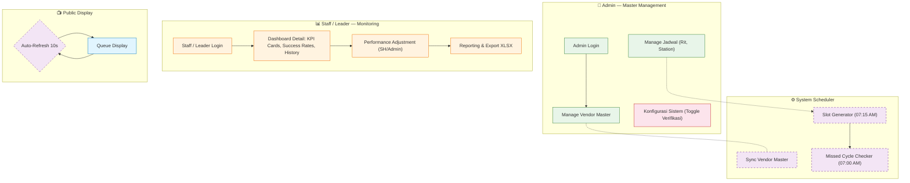

# 3. User Flow — Versi 2.4 (Revisi Besar)

> Copy paste code ke https://mermaid.live/edit untuk view yang lebih jelas
> **Versi:** 2.4 | **Tanggal Revisi:** 2026-05-12
> **Changelog v2.1:** Proses verifikasi Staff dinonaktifkan secara default (self-service mode).
> **Changelog v2.2:** Verifikasi Staff **dikembalikan sebagai fitur opsional** yang dikontrol via `cfg_system.VERIFICATION_MODE_ENABLED`.
> **Changelog v2.3:** Penambahan konsep **expected_date (Operational Date)** & **Cut-off Time**.
> **Changelog v2.4:** Penambahan flow **Officer Discrepancy Marking** dan **Performance Adjustment** pada dashboard detail.

---

## Mode Operasional

Sistem mendukung 2 mode yang dapat diubah kapan saja melalui halaman Admin tanpa perlu deploy ulang:

| Config Key                  | Value               | Mode             | Keterangan                                                                       |
| --------------------------- | ------------------- | ---------------- | -------------------------------------------------------------------------------- |
| `VERIFICATION_MODE_ENABLED` | `false` _(default)_ | **Self-Service** | Vendor langsung `AKTIF` setelah submit. Tidak ada gate Staff.                    |
| `VERIFICATION_MODE_ENABLED` | `true`              | **Verification** | Vendor masuk status `MENUNGGU`, Staff harus Approve/Reject sebelum vendor masuk. |

---

## 1. Main Operational Flow v2.4 — Dual Mode & Post-Submission Activities

---

## 2. Status Lifecycle Entry — Dual Mode

> 💡 Perubahan mode dilakukan di halaman **Admin → Konfigurasi Sistem**, berlaku instan tanpa restart maupun perubahan database.

---

## 3. Diagram Delivery Slot — Missed Cycle Detection & Expected Date

Untuk mengakomodir cycle dari pagi hingga jam 07:00 pagi keesokan harinya, sistem menggunakan **`expected_date`** sebagai penanda hari operasional. Penentuan hari didasarkan pada waktu scan dikurangi batas cut-off (time-shift logic).

---

---

## 3. Performance Adjustment Flow (Detail View)

---

## 4. Support, Monitoring & Admin Flow v2.4

