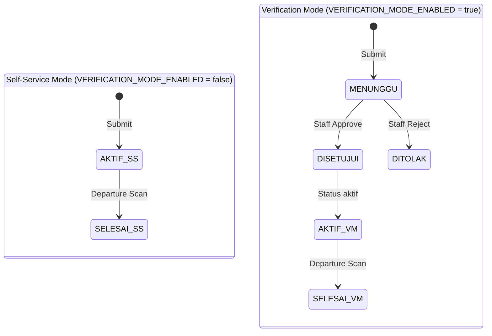
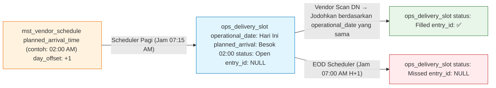
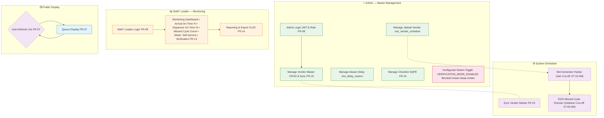

# 3. User Flow — Versi 2.3 (Revisi Besar)

> Copy paste code ke https://mermaid.live/edit untuk view yang lebih jelas
> **Versi:** 2.3 | **Tanggal Revisi:** 2026-04-27
> **Changelog v2.1:** Proses verifikasi Staff dinonaktifkan secara default (self-service mode).
> **Changelog v2.2:** Verifikasi Staff **dikembalikan sebagai fitur opsional** yang dikontrol via `cfg_system.VERIFICATION_MODE_ENABLED`.
> **Changelog v2.3:** Penambahan konsep **Operational Date** & **Cut-off Time (misal: 07:15 AM)** untuk mengakomodir cycle yang melewati tengah malam (hingga 05:00 AM hari berikutnya).

---

## Mode Operasional

Sistem mendukung 2 mode yang dapat diubah kapan saja melalui halaman Admin tanpa perlu deploy ulang:

| Config Key                  | Value               | Mode             | Keterangan                                                                       |
| --------------------------- | ------------------- | ---------------- | -------------------------------------------------------------------------------- |
| `VERIFICATION_MODE_ENABLED` | `false` _(default)_ | **Self-Service** | Vendor langsung `AKTIF` setelah submit. Tidak ada gate Staff.                    |
| `VERIFICATION_MODE_ENABLED` | `true`              | **Verification** | Vendor masuk status `MENUNGGU`, Staff harus Approve/Reject sebelum vendor masuk. |

---

## 1. Main Operational Flow v2.3 — Dual Mode

```mermaid
flowchart TD
    classDef vendor fill:#e1f5fe,stroke:#0277bd,color:#000
    classDef system fill:#f3e5f5,stroke:#6a1b9a,color:#000,stroke-dasharray: 5 5
    classDef staff fill:#fff3e0,stroke:#ef6c00,color:#000
    classDef new fill:#e8f5e9,stroke:#2e7d32,color:#000
    classDef optional fill:#fce4ec,stroke:#c62828,color:#000,stroke-dasharray: 4 4
    classDef endpoint fill:#000,stroke:#000,color:#fff

    %% --- SYSTEM: CUT-OFF AWAL HARI ---
    S_SlotGen["🕗 Awal Hari Operasional (Scheduler: 07:15 AM) Generate ops_delivery_slot Set operational_date = Hari Ini Berdasarkan mst_vendor_schedule Status: Open"]:::new

    %% --- VENDOR ARRIVAL ---
    subgraph VENDOR_ARRIVAL ["🚛 VENDOR — Kedatangan (Arrival)"]
        V_ScanDN["Scan DN & PO (dn_number, po_number)"]:::new
        V_MatchSlot["Sistem: Jodohkan ke Slot Open Paling Awal Slot status → Filled"]:::new
        V_ArrivalCheck{"Waktu aktual vs planned_arrival_time"}:::new
        V_ArrivalStatus["Set arrival_status: On-Time / Late / Early"]:::new
        V_LateReason["Pilih alasan keterlambatan (mst_delay_reason: Arrival) Wajib jika Late"]:::new
    end

    %% --- VENDOR SQPE ---
    subgraph VENDOR_SQPE ["🔍 VENDOR — Self-Inspection SQPE"]
        V_AICheck["Verifikasi APD via Kamera (AI Safety Check) Set ai_safety_status: Pass/Fail"]:::new
        V_Checklist["Isi Checklist SQPE Mandiri (Ya/Tidak per item) FR-03"]:::vendor
        V_Submit["Submit Generate Queue Number FR-04"]:::vendor
    end

    %% --- VERIFICATION GATE (OPSIONAL) ---
    V_ModeCheck{"VERIFICATION_MODE _ENABLED?"}:::system

    subgraph VERIFICATION_OPTIONAL ["⚙️ OPSIONAL — Aktif jika VERIFICATION_MODE_ENABLED = true"]
        V_Wait["Status → MENUNGGU Masuk antrian Staff"]:::optional
        P_List["Staff: Monitoring List FR-09"]:::staff
        P_Drawer["Staff: Review Entry (Identitas, DN/PO, AI Status, Checklist) FR-09"]:::staff
        P_Approve{"Approve? FR-09"}:::staff
        P_RejectReason["Input Alasan Reject FR-09"]:::staff
        S_Rejected(["Status → DITOLAK + Alasan log_audit"]):::optional
        S_Approved(["Status → DISETUJUI log_audit"]):::optional
    end

    %% --- VENDOR DEPARTURE ---
    subgraph VENDOR_DEPARTURE ["🚪 VENDOR — Keberangkatan (Departure)"]
        V_ScanOut["Scan Keluar (Departure)"]:::vendor
        V_DepartureCheck{"Waktu aktual vs planned_departure_time"}:::new
        V_DepartureStatus["Set departure_status: On-Time / Overdue"]:::new
        V_OverdueReason["Pilih alasan terlambat keluar (mst_delay_reason: Departure) Wajib jika Overdue"]:::new
        V_Done(["Status → SELESAI Record ops_timelog lengkap"]):::endpoint
    end

    %% --- SYSTEM EOD ---
    S_MissedCheck["🌅 End of Operational Day (Scheduler: 07:00 AM) Cek ops_delivery_slot untuk operational_date kemarin yang entry_id masih NULL"]:::system
    S_MissedCycle["Set status → Missed log_audit: SLOT_MISSED"]:::system

    %% FLOW
    S_SlotGen --> V_ScanDN
    V_ScanDN --> V_MatchSlot --> V_ArrivalCheck
    V_ArrivalCheck -- "Late" --> V_ArrivalStatus --> V_LateReason --> V_AICheck
    V_ArrivalCheck -- "On-Time / Early" --> V_ArrivalStatus --> V_AICheck
    V_AICheck --> V_Checklist --> V_Submit

    %% MODE SWITCH
    V_Submit --> V_ModeCheck

    %% Self-Service Path
    V_ModeCheck -- "false (Self-Service) Status → AKTIF" --> V_ScanOut

    %% Verification Path
    V_ModeCheck -- "true (Verification Mode)" --> V_Wait --> P_List --> P_Drawer --> P_Approve
    P_Approve -- "Rejected" --> P_RejectReason --> S_Rejected
    P_Approve -- "Approved Status → AKTIF" --> S_Approved --> V_ScanOut

    %% Departure
    V_ScanOut --> V_DepartureCheck
    V_DepartureCheck -- "Overdue" --> V_DepartureStatus --> V_OverdueReason --> V_Done
    V_DepartureCheck -- "On-Time" --> V_DepartureStatus --> V_Done

    S_MissedCheck --> S_MissedCycle
```

---

## 2. Status Lifecycle Entry — Dual Mode

> 💡 Perubahan mode dilakukan di halaman **Admin → Konfigurasi Sistem**, berlaku instan tanpa restart maupun perubahan database.

---

## 3. Diagram Delivery Slot — Missed Cycle Detection & Operational Date

Untuk mengakomodir cycle dari pagi hingga jam 05:00 pagi keesokan harinya, sistem menggunakan **`operational_date`** alih-alih bergantung pada waktu scan vendor aktual. Master jadwal menggunakan `day_offset` (+1) untuk cycle yang melewati tengah malam.

---

## 4. Support, Monitoring & Admin Flow v2.3

