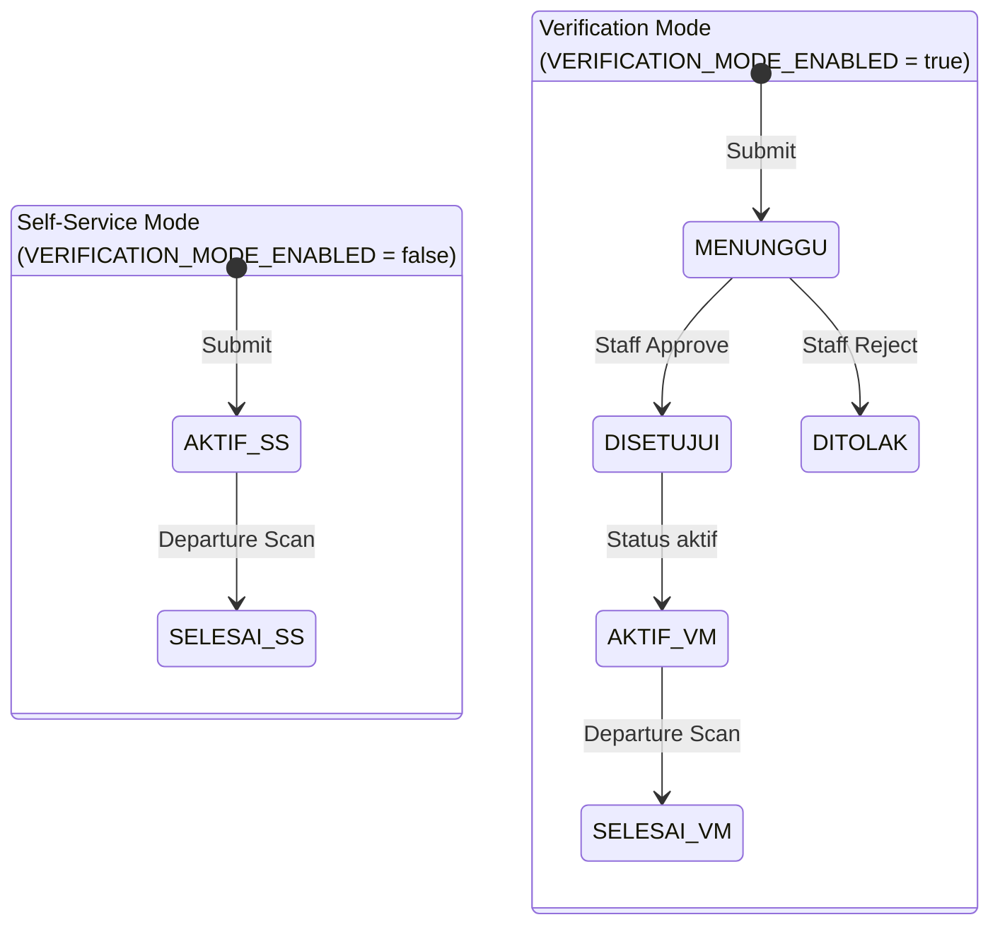
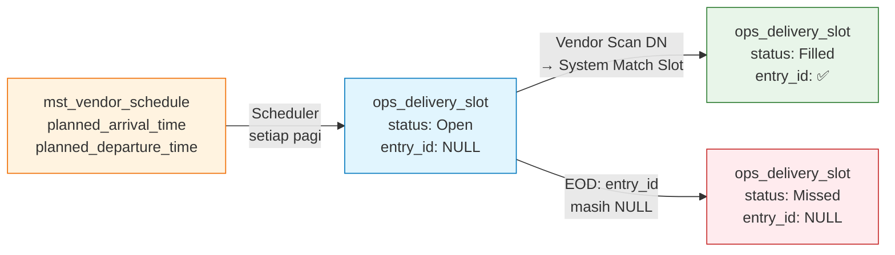
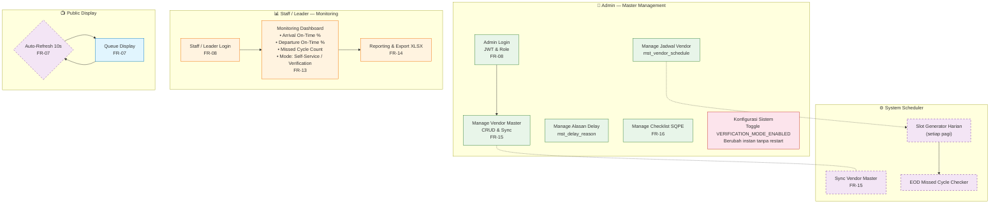

# 3. User Flow — Versi 2.2 (Revisi Besar)

> Copy paste code ke https://mermaid.live/edit untuk view yang lebih jelas
> **Versi:** 2.2 | **Tanggal Revisi:** 2026-04-15
> **Changelog v2.0:** Penambahan Delivery Slot Monitoring, Scan DN/PO, AI Safety Check, Departure Scan, Missed Cycle Detection.
> **Changelog v2.1:** Proses verifikasi Staff dinonaktifkan secara default (self-service mode).
> **Changelog v2.2:** Verifikasi Staff **dikembalikan sebagai fitur opsional** yang dikontrol via `cfg_system.VERIFICATION_MODE_ENABLED`. Tidak dihapus — bisa diaktifkan kembali kapan saja.

---

## Mode Operasional

Sistem mendukung 2 mode yang dapat diubah kapan saja melalui halaman Admin tanpa perlu deploy ulang:

| Config Key | Value | Mode | Keterangan |
|---|---|---|---|
| `VERIFICATION_MODE_ENABLED` | `false` *(default)* | **Self-Service** | Vendor langsung `AKTIF` setelah submit. Tidak ada gate Staff. |
| `VERIFICATION_MODE_ENABLED` | `true` | **Verification** | Vendor masuk status `MENUNGGU`, Staff harus Approve/Reject sebelum vendor masuk. |

---

## 1. Main Operational Flow v2.2 — Dual Mode

```mermaid
flowchart TD
    classDef vendor fill:#e1f5fe,stroke:#0277bd,color:#000
    classDef system fill:#f3e5f5,stroke:#6a1b9a,color:#000,stroke-dasharray: 5 5
    classDef staff fill:#fff3e0,stroke:#ef6c00,color:#000
    classDef new fill:#e8f5e9,stroke:#2e7d32,color:#000
    classDef optional fill:#fce4ec,stroke:#c62828,color:#000,stroke-dasharray: 4 4
    classDef endpoint fill:#000,stroke:#000,color:#fff

    %% --- SYSTEM: PAGI OTOMATIS ---
    subgraph SYSTEM_MORNING ["🕗 SYSTEM — Setiap Pagi (Scheduler)"]
        S_SlotGen["Generate ops_delivery_slot\nBerdasarkan mst_vendor_schedule\nStatus: Open"]:::new
    end

    %% --- VENDOR ARRIVAL ---
    subgraph VENDOR_ARRIVAL ["🚛 VENDOR — Kedatangan (Arrival)"]
        V_ScanDN["Scan DN & PO\n(dn_number, po_number)"]:::new
        V_MatchSlot["Sistem: Jodohkan ke Slot Open\nPaling Awal\nSlot status → Filled"]:::new
        V_ArrivalCheck{"Waktu aktual\nvs planned_arrival_time"}:::new
        V_ArrivalStatus["Set arrival_status:\nOn-Time / Late / Early"]:::new
        V_LateReason["Pilih alasan keterlambatan\n(mst_delay_reason: Arrival)\nWajib jika Late"]:::new
    end

    %% --- VENDOR SQPE ---
    subgraph VENDOR_SQPE ["🔍 VENDOR — Self-Inspection SQPE"]
        V_AICheck["Verifikasi APD via Kamera\n(AI Safety Check)\nSet ai_safety_status: Pass/Fail"]:::new
        V_Checklist["Isi Checklist SQPE Mandiri\n(Ya/Tidak per item)\nFR-03"]:::vendor
        V_Submit["Submit\nGenerate Queue Number\nFR-04"]:::vendor
    end

    %% --- VERIFICATION GATE (OPSIONAL) ---
    V_ModeCheck{"VERIFICATION_MODE\n_ENABLED?"}:::system

    subgraph VERIFICATION_OPTIONAL ["⚙️ OPSIONAL — Aktif jika VERIFICATION_MODE_ENABLED = true"]
        V_Wait["Status → MENUNGGU\nMasuk antrian Staff"]:::optional
        P_List["Staff: Monitoring List\nFR-09"]:::staff
        P_Drawer["Staff: Review Entry\n(Identitas, DN/PO, AI Status, Checklist)\nFR-09"]:::staff
        P_Approve{"Approve?\nFR-09"}:::staff
        P_RejectReason["Input Alasan Reject\nFR-09"]:::staff
        S_Rejected(["Status → DITOLAK\n+ Alasan\nlog_audit"]):::optional
        S_Approved(["Status → DISETUJUI\nlog_audit"]):::optional
    end

    %% --- VENDOR DEPARTURE ---
    subgraph VENDOR_DEPARTURE ["🚪 VENDOR — Keberangkatan (Departure)"]
        V_ScanOut["Scan Keluar\n(Departure)"]:::vendor
        V_DepartureCheck{"Waktu aktual\nvs planned_departure_time"}:::new
        V_DepartureStatus["Set departure_status:\nOn-Time / Overdue"]:::new
        V_OverdueReason["Pilih alasan terlambat keluar\n(mst_delay_reason: Departure)\nWajib jika Overdue"]:::new
        V_Done(["Status → SELESAI\nRecord ops_timelog lengkap"]):::endpoint
    end

    %% --- SYSTEM EOD ---
    subgraph SYSTEM_EOD ["🌙 SYSTEM — End of Day"]
        S_MissedCheck["Cek ops_delivery_slot\nentry_id masih NULL"]:::system
        S_MissedCycle["Set status → Missed\nlog_audit: SLOT_MISSED"]:::system
    end

    %% FLOW
    S_SlotGen --> V_ScanDN
    V_ScanDN --> V_MatchSlot --> V_ArrivalCheck
    V_ArrivalCheck -- "Late" --> V_ArrivalStatus --> V_LateReason --> V_AICheck
    V_ArrivalCheck -- "On-Time / Early" --> V_ArrivalStatus --> V_AICheck
    V_AICheck --> V_Checklist --> V_Submit

    %% MODE SWITCH
    V_Submit --> V_ModeCheck

    %% Self-Service Path
    V_ModeCheck -- "false\n(Self-Service)\nStatus → AKTIF" --> V_ScanOut

    %% Verification Path
    V_ModeCheck -- "true\n(Verification Mode)" --> V_Wait --> P_List --> P_Drawer --> P_Approve
    P_Approve -- "Rejected" --> P_RejectReason --> S_Rejected
    P_Approve -- "Approved\nStatus → AKTIF" --> S_Approved --> V_ScanOut

    %% Departure
    V_ScanOut --> V_DepartureCheck
    V_DepartureCheck -- "Overdue" --> V_DepartureStatus --> V_OverdueReason --> V_Done
    V_DepartureCheck -- "On-Time" --> V_DepartureStatus --> V_Done

    S_MissedCheck --> S_MissedCycle
```

---

## 2. Status Lifecycle Entry — Dual Mode

> 💡 Perubahan mode dilakukan di halaman **Admin → Konfigurasi Sistem**, berlaku instan tanpa restart maupun perubahan database.

---

## 3. Diagram Delivery Slot — Missed Cycle Detection

---

## 4. Support, Monitoring & Admin Flow v2.2

